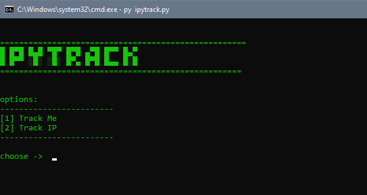

<h1>IPyTRACK</h1>
This tool helps you to view any public IP location with python.
<h2>requirements</h2>
<li>Python</li>
<li>requests</li>
<li>Git</li>
<h2>installation for linux</h2>
<pre>sudo apt install python3
</pre>
<pre>sudo apt install python3-pip
</pre>
<pre>sudo apt install git</pre>
<pre>pip install requests</pre>
<pre>git clone https://github.com/UltraCoderz/ipytrack</pre>
<pre>cd ipytrack</pre>
<pre>python ipytrack.py</pre>

<h2>installation for termux</h2>
<pre>pkg install python -y</pre>
<pre>pkg install python - y</pre>
<pre>pkg install git -y</pre>
<pre>pkg install python-pip</pre>
<pre>pip install requests</pre>
<pre>git clone https://github.com/UltraCoderz/ipytrack</pre>
<pre>cd ipytrack</pre>
<pre>python ipytrack.py</pre>

<h2>installation for windows</h2>
<pre>Download Python <a href="https://www.python.org/downloads/">Here</a></pre>
<pre>Download the zip file of this tool</pre>
<pre>cd ipytrack</pre>
<pre>pip install requests</pre>
<pre>py ipytrack.py</pre>

<h2>features</h2>
<li>simple to use</li>
<li>clear details</li>
<li>you can get google maps of the IP</li>
  
<h2><li>Screenshots</li></h2>

 

developer ~ Thomas Genenew

